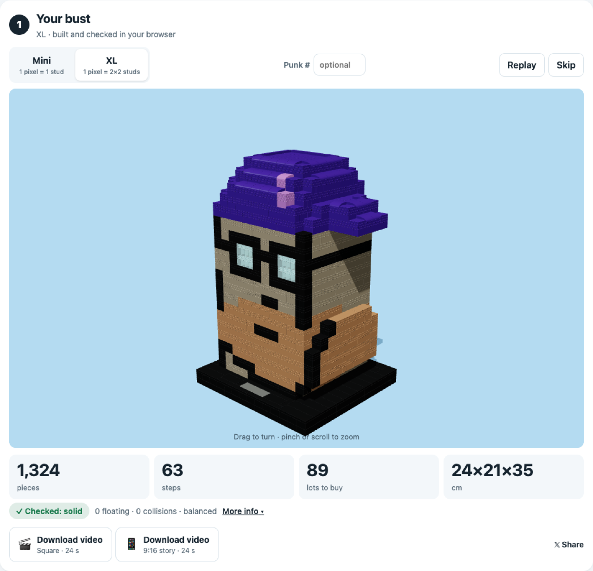
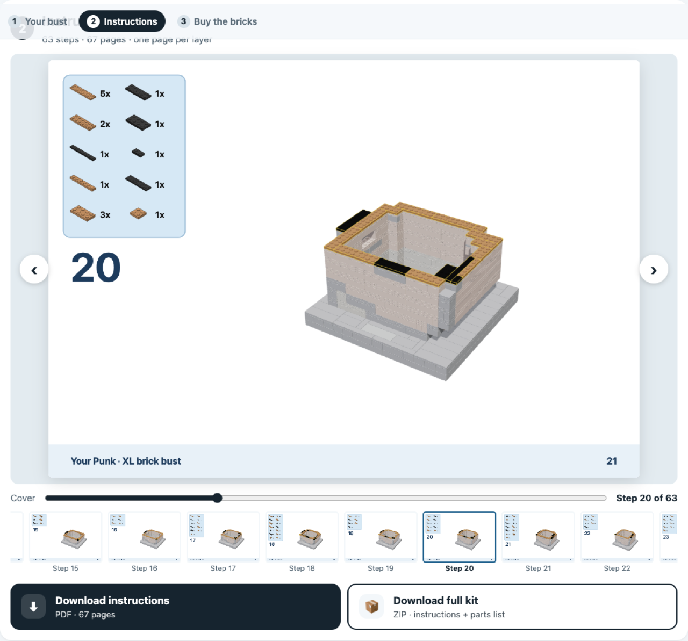
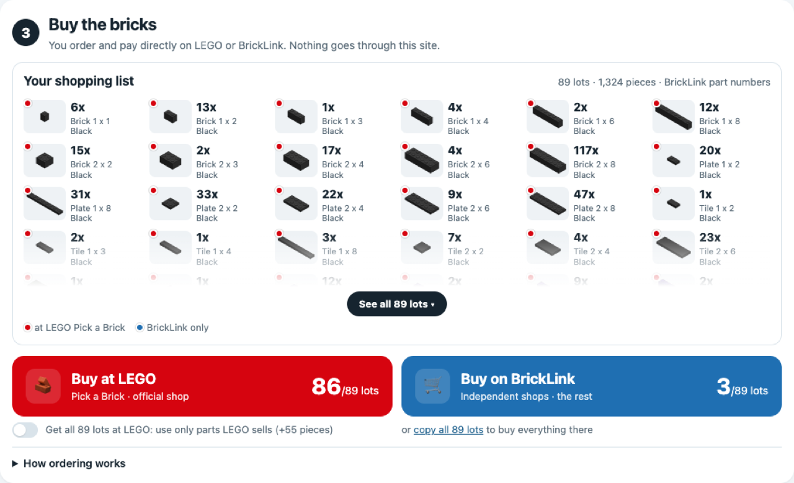

# Punk to Bricks

Turn your CryptoPunk into a brick bust you can really build.

<p align="center">
  <a href="https://hs7j4yk4sz-boop.github.io/punk-to-bricks/"></a>
</p>

<h3 align="center">👉 <a href="https://hs7j4yk4sz-boop.github.io/punk-to-bricks/">Open Punk to Bricks</a> 👈</h3>
<p align="center">Free · runs in your browser · your image never leaves your device</p>

## How to use

1. **Type your Punk number** (0 to 9999), or **drop its image**: the original PNG, a marketplace download or a phone screenshot. No Punk at hand? Click one of the examples.
2. **① Your bust**: watch it build in 3D, pick **Mini** (about 400 pieces) or **XL** (about 1,250 pieces), turn it with your finger or mouse. The key figures are big: pieces, steps, lots to buy, size; "More info" shows every check. Download a video of the build (square or 9:16).
3. **② Instructions**: flip through the step-by-step booklet right on the page, then download it as a PDF or as a full kit (PDF + parts list).
4. **③ Buy the bricks**: see your shopping list (every part, its quantity, red if LEGO sells it, blue if only BrickLink has it), then **Buy at LEGO** (a Pick a Brick upload file) or **Buy on BrickLink** (a wanted list to paste). "Only parts LEGO sells" rebuilds your bust with parts LEGO sells and runs every check again.

<p align="center">
  
  
  
</p>

## What's inside

- **100% static.** Everything runs in the visitor's browser (a Web Worker does the heavy lifting). No server, no AI, no API key, no tracking.
- **Two sizes.** Mini: 1 pixel = 1 stud, rows alternate one brick and two plates so pixels stay square. XL: 1 pixel = 2×2 studs, 5 plates tall, hollow with 2-stud walls.
- **Honest checks.** Every model is checked on its final piece list: studs connected, 0 floating pieces, 0 collisions, centre of mass over the base, weak joints. A failed check is shown, never hidden. Tested on all 10,000 CryptoPunks, in both sizes.
- **Order the bricks.** A Pick a Brick upload file in LEGO's own CSV format (400 references and 999 units per line at most, split into several files when needed) and a BrickLink wanted list (Want → Upload → "Upload BrickLink XML format"). Element IDs come from [Rebrickable](https://rebrickable.com)'s free exports, built into `src/data/elements.json` by `scripts/build-elements.ts` (no live calls). Nothing is sold here: you order and pay on LEGO or BrickLink.
- **Exports.** Full kit ZIP (PDF booklet, one page per layer with the step's parts in colour and outlined in yellow, plus parts inventory; CSV parts list), and square or 9:16 videos of the build ending on the flipping booklet, with brick clicks made in Web Audio.

Inspired by [@victormustar](https://x.com/victormustar)'s Microduck and by [my own CryptoPunk bust](https://github.com/hs7j4yk4sz-boop/cryptopunk-brick-bust).

## How it works

1. **Find the Punk** (`src/core/detect.ts`). Look for a flat background region whose bounding box is a square, read the 24×24 grid from the centre of each cell, and tell background from Punk with a tolerance sized to the image noise (exact on PNG, tolerant on JPEG and screenshots).
2. **Pick brick colours** (`src/core/palette.ts`). Nearest of 38 common BrickLink colours (CIEDE2000); two touching colours that differ are kept apart, the smaller one moves.
3. **Understand the pixels** (`src/core/analyze.ts`). Solid head vs. thin parts (brims, pipes, cigarettes, ears: a 4×4 morphological opening), floating details (smoke) held by clear supports, and the colour each pixel shows on the sides and back.
4. **Build** (`src/core/build.ts`, `src/core/tile.ts`). Stud cells per layer, rounded top and back corners, hollow inside, base sized to the centre of mass. Each layer is filled greedily with real bricks, plates and tiles, alternating direction; hidden cells may take any colour, which lets pieces bridge from a visible detail into the body. Anything left floating is repaired (re-tiling around it, bridging from above or below, or a support stack).
5. **Check** (`src/core/check.ts`) the final piece list.

## Develop

```bash
npm install
npm run dev        # http://localhost:5173
npm test           # unit tests (detection, solidity, exports, all example Punks)
npm run build      # static site in dist/
```

Typing a Punk number uses `public/punks.png`, the official image of all 10,000 CryptoPunks from [larvalabs/cryptopunks](https://github.com/larvalabs/cryptopunks): it is downloaded once, only when a visitor types a number, and the Punk is cut out in the browser. Tests on all 10,000 Punks run when that same file is copied to `real/punks.png` (git-ignored). The drawings in test/fixtures are only used by the tests.

## Notes

Unofficial fan project · Not affiliated with, sponsored or endorsed by the LEGO Group, BrickLink or the CryptoPunks project. LEGO® is a trademark of the LEGO Group. Parts data: Rebrickable. No purchases, payments or personal data go through this site. Models are computer-checked, not physically build-tested.

Made by John Karp · NFT Morning.

## License

[MIT](LICENSE). See also the [disclaimer](DISCLAIMER.md). The license covers the code only, not CryptoPunks images or any trademark.
