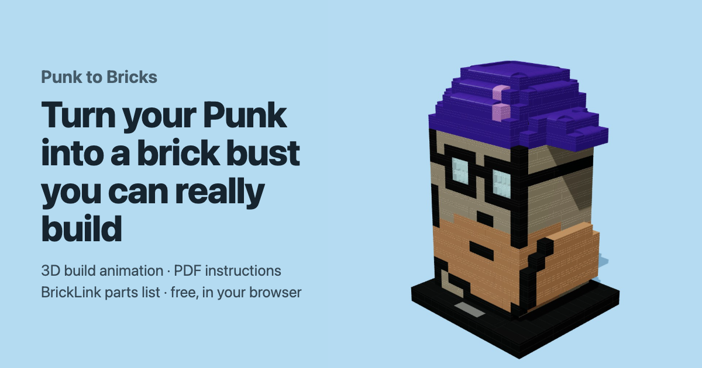

# Punk to Bricks

Turn a CryptoPunk image into a brick bust you can really build: a 3D build animation, step-by-step PDF instructions, a parts list and a BrickLink wanted list.

**Live site:** https://hs7j4yk4sz-boop.github.io/punk-to-bricks/



- **100% static.** Everything runs in the visitor's browser (a Web Worker does the heavy lifting). No server, no AI, no API key. The image never leaves the browser.
- **Two sizes.** Mini: 1 pixel = 1 stud, rows alternate one brick and two plates so pixels stay square (about 400 pieces). XL: 1 pixel = 2×2 studs, 5 plates tall, hollow with 2-stud walls (about 1,250 pieces).
- **Honest checks.** Every model is checked on its final piece list: studs connected, 0 floating pieces, 0 collisions, centre of mass over the base, weak joints. A failed check is shown, never hidden.
- **Exports.** PDF booklet (one page per layer, the step's parts in colour with a yellow outline, parts inventory), CSV parts list, BrickLink XML (Want → Upload), and a square or 9:16 video of the build with brick clicks made in Web Audio.

Inspired by [@victormustar](https://x.com/victormustar)'s Microduck and by [my own CryptoPunk bust](https://github.com/hs7j4yk4sz-boop/cryptopunk-brick-bust).

## How it works

1. **Find the Punk** (`src/core/detect.ts`). Look for a flat background region whose bounding box is a square, read the 24×24 grid from the centre of each cell, and tell background from Punk with a tolerance sized to the image noise (exact on PNG, tolerant on JPEG and screenshots).
2. **Pick brick colours** (`src/core/palette.ts`). Nearest of 38 common BrickLink colours (CIEDE2000); two touching colours that differ are kept apart, the smaller one moves.
3. **Understand the pixels** (`src/core/analyze.ts`). Solid head vs. thin parts (brims, pipes, cigarettes, ears: a 4×4 morphological opening), floating details (smoke) held by clear supports, and the colour each pixel shows on the sides and back.
4. **Build** (`src/core/build.ts`, `src/core/tile.ts`). Stud cells per layer, rounded top and back corners, hollow inside, base sized to the centre of mass. Each layer is filled greedily with real bricks, plates and tiles, alternating direction; hidden cells may take any colour, which lets pieces bridge from a visible detail into the body. Anything left floating is repaired (re-tiling around it, bridging from above or below, or a support stack).
5. **Check** (`src/core/check.ts`) the final piece list.

## Develop

```bash
npm install
npm run dev        # http://localhost:5173
npm test           # unit tests (detection, solidity, exports, all example Punks)
npm run build      # static site in dist/
```

Tests on the 10,000 real CryptoPunks run only if you put the official `punks.png` (from [larvalabs/cryptopunks](https://github.com/larvalabs/cryptopunks)) in `real/`. That folder is git-ignored: the real Punk images are not part of this repository. The example Punks on the site are real Punks used with their owners' permission (public/examples). The drawings in test/fixtures are only used by the tests.

## Notes

Unofficial fan project. Not affiliated with the LEGO Group or the CryptoPunks project. Models are computer-checked, not physically build-tested.

Made by John Karp · NFT Morning.

## License

The code is released under the [0BSD license](LICENSE): do anything you want with it, no conditions, no attribution required. This covers the code only, not CryptoPunks images or any trademark.
